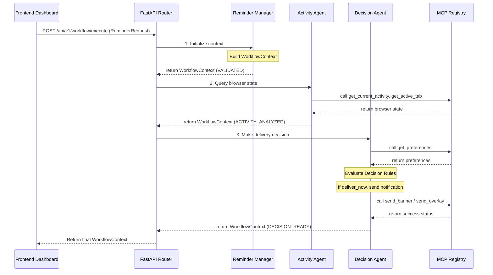

# ReminderAds Architecture

ReminderAds leverages a multi-agent contextual execution architecture built on the Google Agent Development Kit (ADK), Vertex AI (Gemini), FastAPI, and React.

## End-to-End Execution Flow

## Backend Orchestration
The FastAPI backend serves as the orchestration endpoint (`POST /api/v1/workflow/execute`). It feeds the user's `ReminderRequest` into the sequential pipeline:
1. **Reminder Manager**: Instantiates the unified, immutable `WorkflowContext`.
2. **Activity Agent**: Queries browser tools via MCP to evaluate digital state.
3. **Decision Agent**: Pulls preferences, evaluates rules, fires notifications, and populates final decisions.

## Frontend Dashboard
The React dashboard serves as the main demo interface. 
- **API Services**: Uses Axios to interact with the orchestrator.
- **State Audits**: Captures the returned context, parses its execution history and tool metadata into chronological logs, and persists records in `localStorage` for dashboard KPIs and monitor views.
